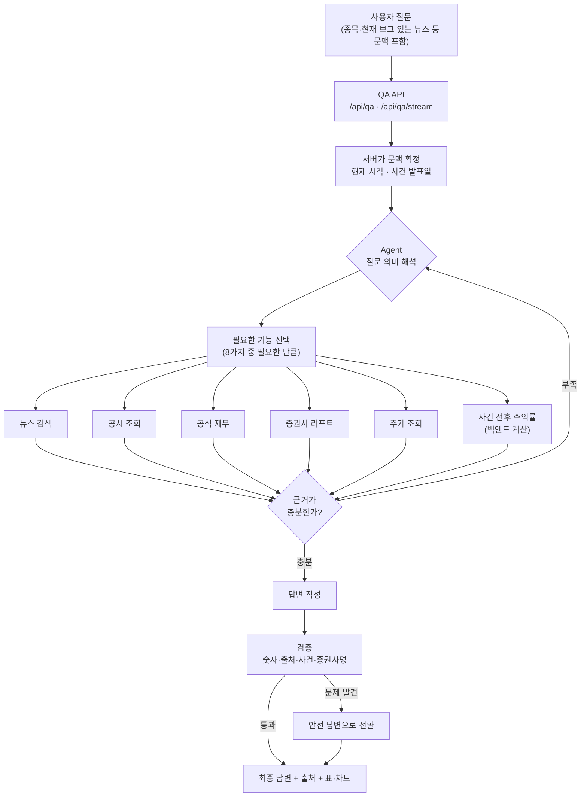

# 주식 AI 어시스턴트 RAG 시스템 개요

Phase 7까지 완료된 현재 시스템을 개발자가 아닌 사람도 이해할 수 있게 정리한 문서다.
모든 설명은 현재 `main`의 실제 코드에서 확인한 내용이며, 코드로 확인되지 않은 것은
**미지원** 또는 **미확인**으로 표시했다.

---

## 1. 이 RAG가 무엇을 해결하는가

주식 투자자가 종목에 대해 궁금한 것을 **일상 언어로 묻고, 근거가 붙은 답을 받는 것**이
목표다.

### 어떤 질문을 할 수 있나

- "삼성전자 현재 주가 알려줘"
- "최근에 무슨 악재 있었어?"
- "2025년 영업이익 공식 숫자 알려줘"
- "증권사 목표주가랑 지금 주가 비교해줘"
- "증권사 의견 말고 회사가 공식 발표한 것만 알려줘"
- "이 뉴스 나온 다음에 주가가 어떻게 됐어?"

### 일반 챗봇과 무엇이 다른가

일반 챗봇은 학습한 기억에서 그럴듯한 문장을 만든다. 숫자가 틀려도 자신 있게 말하고,
"오늘"이 언제인지도 학습 시점 기준으로 착각한다.

이 시스템은 다르게 동작한다.

| | 일반 챗봇 | 이 시스템 |
|---|---|---|
| 숫자의 출처 | 모델의 기억 | 데이터베이스·공식 API에서 조회한 값만 사용 |
| 오늘 날짜 | 학습 시점으로 추측 | 서버가 계산한 현재 시각을 매 요청마다 주입 |
| 근거 | 없음 | 답변마다 출처(기사·공시·리포트·주가) 목록을 함께 반환 |
| 모르는 것 | 그럴듯하게 지어냄 | "데이터가 없다"고 답함 |
| 계산 | 모델이 암산 | 수익률·등락은 백엔드 코드가 계산, 모델은 산술 금지 |

답변을 만든 뒤에도 **검증 단계**를 한 번 더 거친다. 근거 없는 숫자나 없는 증권사 이름이
섞이면 걸러낸다.

### 왜 뉴스·공시·리포트·재무·주가를 함께 쓰는가

투자자의 질문 하나에 여러 종류의 자료가 필요하기 때문이다.

- **뉴스** — 지금 무슨 일이 일어나는지 (사건, 분위기)
- **공시** — 회사가 법적으로 공식 발표한 사실 (DART)
- **증권사 리포트** — 전문가의 목표주가와 전망 (예측치, 확정 사실 아님)
- **공식 재무** — 매출·영업이익 같은 확정된 숫자
- **주가** — 시장에서 실제로 거래된 가격

예를 들어 "목표주가랑 실제 주가 비교"는 리포트(전망)와 주가 API(사실)를 둘 다 봐야 하고,
둘을 섞으면 안 된다. 한 종류만 가지고는 제대로 답할 수 없다.

---

## 2. 전체 구조

> **하나의 Agent가 질문의 의미를 스스로 해석해 필요한 금융 데이터 기능을 골라 호출하고,
> 그 결과만을 근거로 답을 만든 뒤 검증을 통과시키는 Agentic Hybrid RAG.**

"Hybrid"인 이유는 뉴스·리포트처럼 **의미를 찾아야 하는 자료는 검색**으로, 재무·공시·주가처럼
**정확한 값이 있는 자료는 직접 조회**로 나눠 처리하기 때문이다(5절).

"Agentic"인 이유는 어떤 기능을 쓸지 미리 정해진 규칙표가 아니라 Agent가 질문마다 판단하기
때문이다. 키워드로 분기하는 고정 라우터는 코드에 없다.



---

## 3. 질문이 처리되는 과정

### 1) 화면에서 문맥을 함께 보낸다
사용자가 삼성전자 화면에서 질문하면 종목 코드가 같이 전달된다. 특정 뉴스나 공시를 보다가
물으면 그 자료의 식별자도 함께 간다. 그래서 "이거 어떻게 생각해?"처럼 대상을 생략해도
무엇을 말하는지 알 수 있다.

### 2) 서버가 흔들리지 않는 기준을 먼저 확정한다
Agent가 판단하기 **전에** 서버가 두 가지를 확정해 넘긴다.

- **현재 시각** — 모델이 "오늘"을 추측하지 못하게 서버 시각을 주입
- **사건 발표일** — 사용자가 특정 뉴스를 가리켰다면 그 발표일을 서버가 확정 (9절)

### 3) Agent가 질문의 의미를 해석한다
단어가 나왔다고 기능을 호출하지 않는다. 문장 전체의 의미와 **제외 조건**까지 본다.
"증권사 의견은 빼고"라고 하면 리포트 기능을 아예 호출하지 않는다.

### 4) 필요한 기능을 고른다
질문 하나에 여러 개를 부를 수도 있고("재무 + 뉴스"), 하나만 부를 수도 있다. 정확한 숫자
하나만 물으면 그 기능만 쓴다 — 묻지 않은 배경 뉴스까지 뒤지지 않는다.

### 5) 결과를 확인하고, 필요하면 한 번 더 부른다
검색 결과가 조건에 안 맞으면 조건을 바꿔 **최대 한 번** 다시 시도할 수 있다. 같은 조건으로
같은 기능을 반복 호출하는 것은 시스템이 차단한다.

### 6) 답변을 쓴다
기능이 돌려준 값만 쓴다. 없는 값은 만들지 않고, 분기 값을 4배 해서 연간을 만드는 식의
가공도 하지 않는다.

### 7) 검증한다
답변이 완성된 뒤 코드가 5가지를 점검한다(8절). 문제가 있으면 숫자를 고치는 게 아니라
사실에 맞는 안전한 답변으로 **바꾼다**.

### 8) 출처와 함께 돌려준다
답변 문장, 출처 목록, 화면에 그릴 표·차트 데이터가 함께 나간다. 스트리밍(`/api/qa/stream`)은
진행 상황을 순서대로 흘려보낸다.

---

## 4. Agent가 사용할 수 있는 기능

현재 등록된 기능은 **정확히 8가지**다(`app/agent/runtime.py`).

| 기능 | 언제 사용하는지 | 데이터 출처 | 반환하는 정보 | 데이터가 없을 때 |
|---|---|---|---|---|
| **공식 재무 숫자**<br/>`get_financial_facts` | 매출·영업이익·순이익·자산·부채·현금흐름 등 확정 숫자를 물을 때 | Supabase `financials` 테이블 (DART 원본) | 금액, 기간(분기/반기/연간), 연결/별도, 누적/단독 구분, 표시용 문자열 | `no_data` 반환. **다른 분기나 다른 유형으로 대체하지 않음** |
| **금융용어**<br/>`lookup_financial_term` | "PER이 뭐야?" 같은 용어 설명 | Supabase `rag_terms` (한국은행 경제금융용어 등) | 공식 정의, 쉬운 정의, 영문명, 출처와 페이지 | 용어를 못 찾았다고 답함 |
| **뉴스**<br/>`search_news` | 최근 소식, 악재/호재, 특정 주제 뉴스 | Supabase `news_clusters` + `rag_chunks` (의미+키워드 검색) | 사건 제목, 요약, 발행일, 감성, 종목 | 해당 조건 뉴스 없음. **기간을 임의로 넓히지 않음** |
| **공시 검색**<br/>`search_disclosures` | "최근 공시 뭐 있어?" 목록 조회 | Supabase `disclosures` (기본값: 정정 반영된 최신본만) | 접수번호, 제목, 공시일, 정정 여부, DART 공식 뷰어 링크 | 해당 공시 없음 |
| **공시 구조화 값**<br/>`get_disclosure_values` | 배당·증자·자기주식 등 공시 속 **정확한 금액·수량·날짜** | Supabase `structured_disclosures` | 사건 유형, 발표일, 요약, 정규화된 값 | 해당 값 없음 |
| **증권사 리포트**<br/>`search_research_reports` | 목표주가, 투자의견, 전문가 전망 | Supabase `research_reports` 등 (의미+키워드 검색) | 증권사명, 목표주가, 투자의견, 발행일, 근거 문장 | 구조화된 목표주가를 확인할 수 없다고 답함 |
| **주가**<br/>`get_stock_prices` | 현재가, 전일 대비, **사용자가 기간을 말한** 수익률 | 토스증권 Open API (`openapi.tossinvest.com`) | 현재가, 등락률, 거래일, 기간 시작·종료 종가와 수익률 | `no_data`. 지원하지 않는 종목은 `error`(오류와 구분) |
| **사건 전후 수익률**<br/>`calculate_event_return` | "이 뉴스 발표 후 주가 어떻게 됐어?" | 토스증권 Open API + 서버가 확정한 사건 발표일 | 발표 전 마지막 거래일 종가 기준 1·3·5거래일 종가와 수익률 | 발표 후 확정 거래일이 없으면 `no_data`. **다른 기간으로 대체 안 함** |

**중요:** 마지막 기능은 발표일을 모델에게서 받지 않는다. 서버가 확정한 값만 쓴다. 모델이
날짜를 지어내는 것을 구조적으로 막기 위해서다.

---

## 5. 검색과 정확 조회의 차이

이 시스템은 자료 성격에 따라 **두 가지 방식**을 나눠 쓴다.

### 검색 — 뉴스와 증권사 리포트

말로 표현된 자료라 "비슷한 뜻"을 찾아야 한다. 두 방식을 동시에 쓴다.

1. **의미 검색** — 질문을 숫자 벡터로 바꿔(Upstage `solar-embedding-2`, 1024차원)
   뜻이 가까운 문단을 찾는다. "실적이 나빠졌어?"로 "영업이익 감소" 문서를 찾을 수 있다.
2. **키워드 검색** — 글자가 실제로 겹치는 것을 찾는다(pg_trgm). 고유명사·모델명에 강하다.

**두 결과를 RRF로 합친다.** RRF(Reciprocal Rank Fusion)는 점수를 직접 더하지 않고
**순위**를 기준으로 합치는 방식이다.

```
최종점수(문서) = 1/(50 + 의미검색 순위) + 1/(50 + 키워드검색 순위)
```

점수 체계가 다른 두 검색(코사인 유사도 vs 글자 유사도)을 그대로 더하면 한쪽이 지배해버린다.
순위로 바꿔 더하면 **양쪽에서 고르게 상위권인 문서**가 최종 1위가 된다.
- 실제 결합은 데이터베이스 함수(`rag_search_hybrid`)에서 수행한다.
- 상수 `k = 50`, 의미·키워드 가중치는 각 1.0.
- 참고용 파이썬 구현이 `app/rag/fusion.py`에 있으나 실제 서비스 경로는 DB 함수다.

> 뉴스 기능에서 검색어 없이 "최근 뉴스"만 물으면 검색을 하지 않고 최신순 목록을 바로
> 가져온다. 벡터 검색이 불필요한 경우 호출하지 않는다.

### 정확 조회 — 재무·공시·용어

"2025년 영업이익"에 **비슷한 값**은 의미가 없다. 정답 하나만 맞다.
그래서 검색하지 않고 조건으로 정확히 걸러 가져온다: 종목·연도·보고기간·연결여부로
데이터베이스를 직접 조회한다.

### 주가는 API에서

주가는 데이터베이스가 아니라 토스증권 Open API에서 실시간 조회한다.

### 수익률은 반드시 백엔드가 계산

모델은 **어떤 산술도 하지 않는다.** 등락률·기간 수익률·사건 전후 수익률은 모두
`StockPriceService` 한 곳에서만 계산하고, 모델은 계산된 결과를 문장으로 옮기기만 한다.
언어 모델의 암산은 신뢰할 수 없기 때문이다.

### 왜 전부 벡터 검색으로 하지 않나

| | 벡터 검색 | 정확 조회 |
|---|---|---|
| 잘 맞는 자료 | 뉴스, 리포트 (말로 된 것) | 재무, 공시 값, 주가 (숫자) |
| "2025년 영업이익" 질문 | 2024년 문서도 비슷하다고 판단해 섞일 수 있음 | 2025년 행만 정확히 반환 |
| 값이 없을 때 | 비슷한 걸 그럴듯하게 내놓음 | "없음"이 명확 |

숫자를 벡터 검색으로 다루면 **다른 기간·다른 회사 숫자가 섞이는 사고**가 난다.
이 시스템이 가장 피하려는 오류가 바로 그것이라, 숫자는 검색하지 않는다.

---

## 6. LangChain과 LangGraph

### LangChain의 `create_agent`가 하는 일
`app/agent/runtime.py`에서 `create_agent` 하나를 호출해 Agent를 만든다. 여기에
① 언어 모델 ② 8가지 기능 ③ 안전장치 미들웨어 ④ 서버가 넘길 문맥의 형태를 연결한다.
"질문 받기 → 기능 호출 → 결과 보고 → 다시 판단 → 답변" 루프를 프레임워크가 제공한다.

### LangGraph runtime이 하는 일
`create_agent`가 만드는 Agent는 내부적으로 LangGraph 그래프로 실행된다. 상태 관리,
단계 진행, 반복 상한(`recursion_limit`) 같은 실행 엔진 역할을 LangGraph가 맡는다.
서버는 안전장치로 이 상한을 계산해 넘긴다.

### 직접 StateGraph를 작성하지 않았다
노드와 엣지를 직접 그린 그래프 코드는 **저장소에 없다**(전체 검색으로 확인). 질문을
"단순/복잡"으로 나누는 분류기도, 키워드 라우터도, 예전 계획 기반 경로(QueryPlan)도 없다.
Agent 미구성 시 옛 경로로 돌아가지 않고 503으로 응답한다.

### 그래도 LangGraph 기반 Agentic RAG인 이유
그래프를 손으로 그리지 않았을 뿐, 실행은 LangGraph 위에서 이뤄진다. 그리고
**어떤 자료를 볼지 실행 중에 스스로 정하고, 결과를 보고 다시 판단하는** 구조라
Agentic RAG의 정의에 부합한다. 고정된 순서로 검색→생성만 하는 전통적 RAG와 다르다.

---

## 7. 실제 프롬프트 구성

### 어디에 무엇이 있나

| 구분 | 파일 위치 | 언제 쓰이나 | 역할 |
|---|---|---|---|
| Agent 시스템 프롬프트 | `app/agent/prompts.py` | 매 요청마다 조립 | 행동 원칙 전체 |
| 서버 시간 문맥 | `app/agent/prompts.py` (같은 함수) | 매 요청마다 | 현재 날짜·시각 주입 |
| 사건 문맥 | `app/agent/prompts.py` `_event_context_block()` | 사건이 확정/모호할 때 | 발표일 고정 또는 후보 제시 지시 |
| 각 기능 설명 | `app/agent/runtime.py` 각 기능의 docstring | 모델이 기능을 고를 때 | 이 기능이 무엇인지, 언제 쓰는지 |

시스템 프롬프트는 정적인 원칙 + 요청 시점 정보(시간·사건)를 합쳐 매번 새로 만든다.

### 프롬프트의 중요한 규칙

- **제외 조건 처리** — "제외/말고/아닌/빼고"의 범위를 지킨다. 제외 대상은 조회도 하지 않고
  답변에도 넣지 않는다.
- **실제값과 전망값 구분** — 증권사 목표주가·전망은 예측치다. 공식 재무·공시와 섞어
  설명하지 않는다. 목표주가는 구조화된 값(`stated`)만 쓰고, 본문 텍스트의 숫자나 과거
  이력을 현재 목표주가로 쓰지 않는다. 여러 날짜 값을 "7만~14만원대"처럼 범위로 합성하지
  않는다.
- **데이터 없음 처리** — 기능이 "없음"을 주면 솔직히 없다고 답한다. 다른 기간·다른 기업·
  다른 문서로 대체하지 않는다.
- **주가 인과관계 단정 금지** — "이 뉴스 때문에 올랐다"고 하지 않는다. "발표 이후
  상승했다"처럼 **시간 관계만** 표현한다.
- **사건 후속 질문 처리** — 사건 기준 질문과 일반 기간 질문을 절대 섞지 않는다(9절).
- **출처와 숫자 사용 규칙** — 제공된 출처만 인용한다. 기능이 주지 않은 증권사·목표주가·
  날짜를 만들지 않는다. 수익률을 직접 계산하지 않는다.
- **투자 추천 금지** — 매수·매도 의견을 내지 않는다.

### 프롬프트가 막는 오류 vs 코드가 막는 오류

둘은 역할이 다르다. **프롬프트는 부탁이고, 코드는 강제다.**

| | 프롬프트(지시) | 코드(강제) |
|---|---|---|
| 성격 | 모델이 따라주기를 기대 | 어기는 것이 불가능 |
| 담당 | 어떤 기능을 고를지, 어떤 말투로 설명할지, 제외 조건 해석, 인과 단정 회피 | 발표일 주입, 호출 횟수 제한, 중복 호출 차단, 근거 없는 숫자 검출, 없는 증권사명 검출, 목표주가 대조, 사건 근거 확인 |
| 실패 시 | 모델이 무시할 수 있음 | 실행 자체가 차단되거나 검증에서 걸림 |

예를 들어 "사건 발표일을 추측하지 마라"는 프롬프트에도 있지만, 실제로는 **기능의 입력
자체에서 날짜를 받지 않게** 만들어 구조적으로 막았다. 이게 코드로 막는다는 뜻이다.

> 참고: 계획을 먼저 세우고 실행하던 예전 QueryPlan 경로는 폐기됐다. 현재 프롬프트에는
> 그 개념이 없다.

---

## 8. 정확성과 안전장치

프롬프트와 별개로 코드에 실제 구현된 장치들이다.

### 실행을 제한하는 장치

| 장치 | 실제 설정 | 이유 |
|---|---|---|
| 모델 호출 횟수 제한 | 요청당 **4회** | 무한 반복 방지 |
| 기능 호출 횟수 제한 | 요청당 **5회** | 과도한 외부 조회 방지 |
| 동일 기능 반복 호출 방지 | 같은 기능+같은 조건 **1회 초과 차단** | 같은 조회를 되풀이하며 시간 끄는 것 방지 |
| 전체 제한시간 | **45초** | 응답이 무한정 매달리지 않게 |
| 개별 모델 호출 제한시간 | **20초** | 외부 API가 멈춰도 전체가 멈추지 않게 |
| 재시도 | 검색 기능만 **1회**, 모델 **1회** | 일시적 오류 흡수 (무한 재시도 아님) |
| 단계 상한 | 위 한도로 계산된 값 | 위 장치를 뚫는 루프의 최종 방어선 |

### 데이터 접근을 제한하는 장치

- **읽기 전용** — 모든 조회 기능은 SELECT만 한다. 데이터를 수정·삭제하는 경로가 없다.
- **자유 SQL 금지** — 모델이 SQL을 만들거나 실행하는 경로가 **없다**. 정해진 입력 항목
  (종목코드, 연도, 기간 등)만 채울 수 있다.
- **서비스는 모델에게 보이지 않음** — 데이터베이스 연결이나 인증 정보는 프롬프트에
  들어가지 않고, 실행 시점에 코드로만 주입된다.

### 답변을 검사하는 장치 (`app/agent/validator.py`)

답변 작성 후 5가지를 점검한다.

1. **없는 인용 번호** — 출처가 없는데 인용을 달았는지
2. **근거 없는 숫자** — 큰 숫자가 있는데 이를 뒷받침할 조회 결과가 없는지
   (날짜와 종목코드는 재무 숫자가 아니므로 제외하고 검사)
3. **없는 증권사명** — 조회 결과에 없는 증권사를 답변이 만들어냈는지
4. **목표주가 불일치** — 답변의 목표주가가 구조화 근거값과 다른지
5. **사건 근거 부족** — "이 뉴스 이후 N% 올랐다"고 했는데 사건 전후 계산 결과가 없는지

검증기는 **숫자를 고치지 않는다.** 대신 문제가 있으면 사실에 맞는 안전한 답변으로
바꾸고, 잘못된 근거로 만든 차트도 함께 제거한다.

### 그 밖의 규칙

- **실제값·전망값 구분** — 출처마다 실제값/전망값 표시가 붙어 화면에서 구분된다.
- **사건이 여러 개면 사용자에게 확인** — 임의로 고르지 않는다(9절).
- **사건 이후 데이터 없으면 대체 금지** — 다른 기간 수익률로 바꿔 답하지 않는다.
- **다른 종목 혼입 방지** — 지원하지 않는 종목은 명확히 거절하고, 리포트의 종목이 요청과
  다르면 목표주가를 신뢰하지 않는 상태로 강등한다.
- **내부 추론·비밀값 미노출** — 모델의 사고 과정, 기능의 원본 입력값, API 키는 응답에
  포함되지 않는다. 오류가 나도 내부 예외 메시지 대신 일반 안내 문구로 바꿔 내보낸다.
- **데이터 없음과 시스템 오류 구분** — "찾았지만 없음(`no_data`)"과 "조회 실패(`error`)"를
  다른 상태로 표시한다. 사용자에게도 다르게 안내된다.

---

## 9. 사건 후속 질문

"그 뉴스 이후 주가가 어떻게 됐어?"는 이 시스템이 가장 공들인 부분이다. 아래는 특정 뉴스에만
적용되는 예외 처리가 아니라 **모든 사건 질문에 동일하게 적용되는 일반 규칙**이다.

### 무엇이 어려운가

"그 뉴스"가 무엇인지 애매하다. 앞선 답변에 기사가 8건 있었다면 어느 것을 말하는지 알 수
없다. 과거에는 이럴 때 시스템이 **최근 1개월 수익률**을 대신 답하는 결함이 있었다. 질문한
사건과 아무 상관없는 숫자를 자신 있게 말한 것이다.

### 지금은 이렇게 처리한다

**① 같은 사건을 보도한 여러 기사 → 하나의 사건으로 묶는다**
종목·발표일·제목이 같은 기사들은 한 사건으로 취급한다. 언론사 5곳이 같은 발표를 보도했다고
사건이 5개가 되지는 않는다.

**② 서로 다른 사건이 여러 개 → 사용자에게 되묻는다**
묶은 결과가 2개 이상이면 **자동으로 고르지 않는다.** 제목과 날짜를 후보로 보여주고 어떤
사건인지 물어본다. 이때 주가 조회 기능은 아예 호출되지 않는다.

**③ 사용자가 특정 뉴스를 선택 → 그 사건으로 확정**
화면에서 기사를 고르면 그 사건이 우선한다.

**④ 발표일은 서버가 확정해 전달한다**
확정된 발표일은 프롬프트에 실려 Agent에게 전달되지만, 계산 기능은 이 값을 **서버 문맥에서
직접** 읽는다. Agent가 날짜를 넘기는 경로 자체가 없어서 날짜를 지어낼 수 없다.

**⑤ 발표 전후 실제 거래일로 계산한다**
- **기준점**: 발표일 **이전** 마지막 거래일 종가 (발표 당일은 이미 소식이 반영됐을 수
  있어 제외하는 보수적 기준)
- **비교 시점**: 발표 후 **1·3·5거래일**째 종가
- 주말·공휴일은 자동으로 건너뛴다. 달력 날짜가 아니라 실제 거래일 기준이다.
- 아직 5거래일이 지나지 않았다면 **1일·3일만 반환하고 5일치는 만들지 않는다.**

**⑥ 발표 이후 거래 데이터가 없으면 계산하지 않는다**
금요일 밤이나 토요일에 발표된 뉴스는 아직 거래일이 없다. 이때는 "발표 이후 확정 거래일
데이터가 아직 없어 계산할 수 없습니다"라고 답하고, 차트도 만들지 않는다.

### 왜 최근 한 달 수익률로 대신 답하지 않는가

사용자가 물은 것은 **"이 사건의 영향"**이다. 최근 한 달 수익률은 그 사건과 무관한 온갖
요인이 섞인 숫자다. 그것을 답으로 주면 **틀린 답을 맞는 답처럼** 보여주는 것이라, 아예
답하지 않는 것보다 나쁘다.

그래서 대체를 프롬프트로 부탁하는 데 그치지 않고, 사건 계산 기능에서 기간 조회 입력을
**제거**해 구조적으로 불가능하게 만들었다.

---

## 10. 실제 질문 예시

Agent는 질문마다 필요한 기능을 스스로 고른다. 아래 "사용될 수 있는 기능"은 고정된
라우팅표가 아니라 **일반적인 경우의 예시**다.

### 1. "삼성전자 현재 주가 알려줘"
- **필요한 데이터**: 실시간 주가
- **사용될 수 있는 기능**: 주가 조회
- **답변에서 확인**: 기준 거래일, 현재가, 전일 대비 등락률, 주가 출처
- **답할 수 없을 때**: 지원하지 않는 종목이면 명확히 거절 (다른 종목으로 바꾸지 않음)

### 2. "최근 악재 알려줘"
- **필요한 데이터**: 최근 부정적 뉴스
- **사용될 수 있는 기능**: 뉴스 검색 (최근 범위 + 부정 감성)
- **답변에서 확인**: 기사 제목·발행일, 핵심 요약, 기사 출처
- **답할 수 없을 때**: 해당 기간에 없으면 없다고 답함. **기간을 몰래 넓히지 않음**

### 3. "2025년 공식 영업이익 알려줘"
- **필요한 데이터**: DART 확정 재무
- **사용될 수 있는 기능**: 공식 재무 숫자 (연도 지정, 보고기간 없으면 연간으로 해석)
- **답변에서 확인**: 금액, 기간(연간/분기), 연결/별도, 누적/단독, 공식 출처
- **답할 수 없을 때**: 해당 기간 값이 없다고 답함. **다른 분기 값으로 대체하지 않음**

### 4. "목표주가와 현재 주가 비교해줘"
- **필요한 데이터**: 증권사 목표주가(전망) + 실제 주가(사실)
- **사용될 수 있는 기능**: 증권사 리포트 + 주가 조회
- **답변에서 확인**: 두 값이 **명확히 구분**되는지, 증권사명과 발행일, 목표주가가 구조화
  근거와 일치하는지
- **답할 수 없을 때**: 구조화된 목표주가가 없으면 확인할 수 없다고 답함

### 5. "증권사 의견은 빼고 알려줘"
- **필요한 데이터**: 공식 자료만 (공시·재무)
- **사용될 수 있는 기능**: 공시 검색 / 공식 재무 — **리포트 기능은 호출하지 않음**
- **답변에서 확인**: 증권사 전망이 섞이지 않았는지, 공식 출처만 인용됐는지
- **답할 수 없을 때**: 무엇에 대한 공식 정보인지 불명확하면 되물음

### 6. "이 뉴스 이후 주가가 어떻게 됐어?"
- **필요한 데이터**: 확정된 사건 발표일 + 발표 전후 주가
- **사용될 수 있는 기능**: 사건 전후 수익률 (사건이 확정된 경우에만)
- **답변에서 확인**: 발표일, 기준 거래일과 비교 거래일, 1·3·5거래일 수익률, 사건 출처와
  주가 출처, 인과 단정이 없는지
- **답할 수 없을 때**: 사건이 여러 개면 후보를 보여주고 되물음. 발표 후 거래일이 없으면
  계산할 수 없다고 답함. **어느 경우에도 다른 기간 수익률로 대체하지 않음**

---

## 11. 현재 지원 범위와 한계

| 항목 | 상태 | 설명 |
|---|---|---|
| 뉴스 | ✅ 지원 | 의미+키워드 검색, 사건 단위 묶음, 감성 표시 |
| 공시 (목록) | ✅ 지원 | 정정 반영 최신본 기준, DART 공식 뷰어 링크 제공 |
| 공시 (구조화 값) | ✅ 지원 | 배당·증자·자기주식 등 정확한 금액·수량·날짜 |
| 공식 재무 | ✅ 지원 | 분기/반기/연간, 누적/단독, 연결/별도 구분 |
| 증권사 리포트 | ✅ 지원 | 최신 우선, 90일 넘으면 오래된 자료로 표시 |
| 목표주가 | ⚠️ 부분 지원 | 구조화 추출된 값(`stated`)만 사용. 리포트 본문에만 있고 구조화되지 않은 목표주가는 답변에 쓰지 않음 |
| 주가 | ⚠️ 부분 지원 | 지원 종목 목록에 한정. 일봉은 1회 200건·최대 4페이지 |
| 사건 전후 수익률 | ✅ 지원 | 1·3·5거래일. 단, 화면이 사건 정보를 보내야 정확히 동작 (아래 참조) |
| 실제 실적 vs 증권사 전망 비교 | ❌ 미지원 | 리포트에서 전망 재무수치를 구조화된 값으로 추출하지 못함. 비교 차트(`financial_comparison`)는 정의만 있고 실제로 생성되지 않음 |
| 장기 대화 기억 | ❌ 미지원 | 서버가 대화를 저장하지 않음. 각 요청은 독립적이며, 문맥은 요청에 실려 올 때만 유지됨 |
| 실시간 기능 진행 상태 | ⚠️ 부분 지원 | 스트리밍 연결과 이벤트 순서는 정상이나, 현재 Agent를 한 번에 실행하는 방식이라 기능 진행 이벤트가 실행 도중이 아니라 완료 후 전달됨 |
| 데이터가 없는 질문 | ✅ 지원 | "없음"과 "오류"를 구분해 안내. 근거 없는 숫자를 만들지 않음 |

### 알아둘 한계

1. **화면이 아직 사건 정보를 보내지 않는다.** 백엔드는 사건 문맥(`event_context`)을 받을
   준비가 돼 있지만, 프런트엔드는 현재 종목과 단일 출처 식별자만 보낸다. 그래서 실제 화면
   에서 "그 뉴스 이후"라고 물으면 대부분 "어떤 뉴스인지 알려달라"는 되물음이 나온다.
   **틀린 숫자가 나오지는 않지만**, 사건 전후 계산의 정확도를 얻으려면 화면 연동이 필요하다.
2. **지원 종목이 제한적이다.** 주가 조회는 정해진 종목 목록 안에서만 동작한다.
3. **뉴스·공시 데이터의 커버리지**는 수집 파이프라인이 채운 범위에 한정된다. 아주 오래된
   사건은 자료가 없을 수 있다.
4. **용어 조회의 유사 검색**은 부분 문자열 일치 방식이다. 코드 주석은 "유사도"라고 적혀
   있으나 실제로는 유사도 함수를 쓰지 않는다(미확인 항목 아님, 코드로 확인된 차이).

---

## 12. 핵심 코드 위치

| 역할 | 경로 |
|---|---|
| QA API (동기·스트리밍) | `backend/app/api/routes/qa.py` |
| 요청·응답 스키마 | `backend/app/schemas/qa.py` |
| Agent 실행·타임아웃·안전 답변 전환 | `backend/app/services/agent_qa.py` |
| Agent 생성, 기능 등록 | `backend/app/agent/runtime.py` |
| 시스템 프롬프트 | `backend/app/agent/prompts.py` |
| 중복 호출 차단·오류 문구 정리 | `backend/app/agent/middleware.py` |
| 답변 검증 | `backend/app/agent/validator.py` |
| 사건 확정 규칙 | `backend/app/agent/event_reference.py` |
| 실행 시 주입되는 문맥 | `backend/app/agent/context.py` |
| 서버 시간 문맥 | `backend/app/agent/time_context.py` |
| 각 기능 구현 | `backend/app/agent/tools/` (`financials.py`, `news.py`, `disclosures.py`, `reports.py`, `prices.py`, `terms.py`, `common.py`) |
| 검색기 (의미·하이브리드) | `backend/app/rag/retrieval.py` |
| RRF 참조 구현 | `backend/app/rag/fusion.py` |
| RRF 실제 결합 (DB 함수) | `backend/migrations/0017_rag_hybrid_rrf.sql`, `0018_rag_hybrid_lexical_exact_first.sql` |
| 임베딩 | `backend/app/ml/embeddings.py` |
| 재무·공시·용어 정확 조회 | `backend/app/services/facts.py` |
| 증권사 리포트 조회 | `backend/app/services/research_reports.py` |
| 주가·수익률 계산 | `backend/app/services/stock_prices.py` |
| 토스 API 클라이언트 | `backend/app/sources/prices.py` |
| 설정값 (한도·모델·타임아웃) | `backend/app/core/config.py` |

---

## 13. 다음 단계

- **Phase 7까지 기능 구축이 완료됐다.** 질문 → 자료 조회 → 근거 기반 답변 → 검증까지
  전체 경로가 동작하고, 운영 배포와 smoke test를 마쳤다.
- **Phase 8에서는 대량의 질문을 돌려 평가한다.** 정확성, 검색 품질, 출처, 응답 속도, 비용을
  측정하는 단계다.
- **평가에서 발견된 치명적인 문제만 소폭 수정한다.** 새 기능을 추가하는 단계가 아니다.
