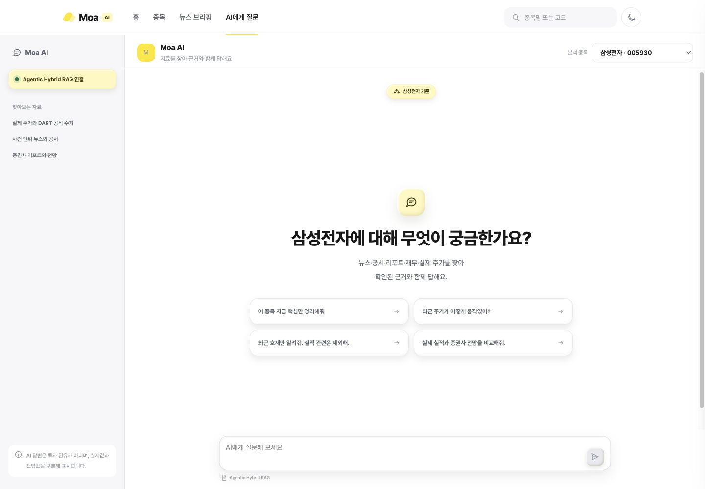
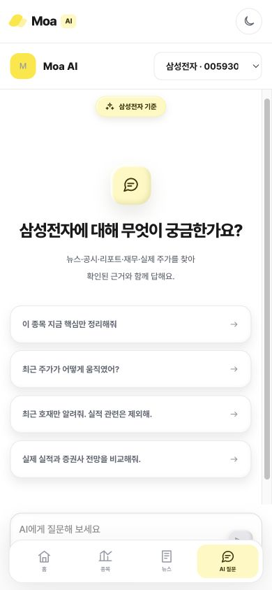
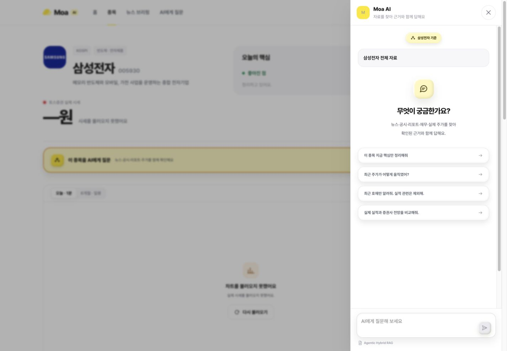
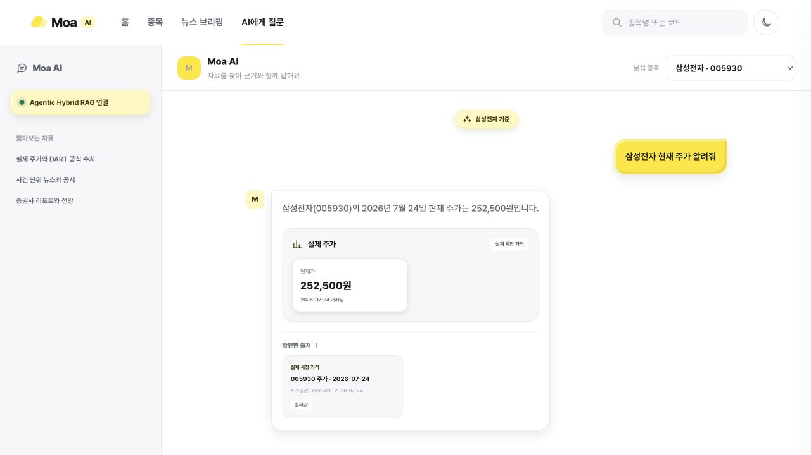

# Phase 7 프런트 연결 완료 보고

- 완료일: 2026-07-25
- 브랜치: `phase/7-agent-rag-ui`
- 상태: 구현·테스트·로컬 실제 Agent smoke 완료, PR 후보
- 미수행: 운영 배포, 자동 머지, Phase 8

## 1. 구현 화면

- 전역 `/ask`: 종목 선택, 추천 질문, 이전 질문, 스트리밍 답변, 중단/재시도/새 질문
- 종목 상세: “이 종목을 AI에게 질문” launcher와 종목 문맥 패널
- 홈/뉴스/종목의 뉴스 상세·선택 영역: 기존 모든 `onAsk`가 공통 RAG 패널 사용
- DART 공시/증권사 리포트 행: 기존 질문 버튼이 동일 패널과 문맥 계약 사용
- 데스크톱 우측 패널, 뉴스 모달 옆 dock, 모바일 하단 드로어

별도 공시/리포트 상세 route는 현재 제품에 없으므로 만들지 않았다.

## 2. 재사용/신규 컴포넌트

재사용:

- `AssistantPanel`의 패널/드로어 레이아웃
- 기존 `Icon`, `LoadingDots` 계열 디자인 언어
- `DisclosureList`, `ReportList`, 뉴스 카드/상세의 `onAsk`
- 기존 색상·spacing·타이포·dark mode 토큰
- 기존 `Intl.NumberFormat` 방식

신규:

- `RagConversation`: 페이지/패널 공통 대화 코어
- `RagVisualizations`: typed payload 전용 카드/compact chart
- `useRagConversation`: SSE/Abort/phase/message 상태
- `api/qa.ts`: 안전한 SSE parser와 context request

클레이모피즘은 AI 입력창, 추천 버튼, context badge, 숫자/출처 카드에 soft outer
shadow + inset highlight + pressed state로만 적용했다.

## 3. QA 문맥 연결

- 종목: `stock_code`
- 뉴스: `stock_code + context_source_type=news_event + context_source_id`
- 공시: `stock_code + dart_document + source_id/document_id(있을 때)`
- 리포트: `stock_code + research_report + source_id + report_page(있을 때)`
- 질문 단어에 따른 Tool 강제/키워드 router 없음
- 사용자가 질문에서 다른 종목을 말하면 기존 Agent 판단에 맡김
- UI에 “삼성전자 기준”, “현재 뉴스 기준”, “현재 리포트 N페이지 기준” 배지 표시

## 4. SSE와 진행 상태

프런트 phase:

```text
idle → connecting → running → streaming → completed
                                   ├→ error
                                   └→ aborted
```

Tool 이름은 사용자 문구로만 표시한다. 원시 인자/Tool payload/내부 추론은 표시하지
않는다. Enter 전송, Shift+Enter 줄바꿈, 명시적 중단 버튼, 재시도를 지원한다.

현재 백엔드의 Agent 호출은 동기 `invoke`라 Tool/답변 이벤트가 Agent 종료 후 전달되는
제약이 있다. 프런트는 incremental `delta` 계약을 완전히 지원한다.

## 5. 지원 시각화

- `price_snapshot`
- `price_line`
- `event_return`
- `broker_targets`
- `financial_series`
- `financial_comparison`
- `disclosure_metrics`
- `event_timeline`
- `term_definition`

현재 실제 builder가 생성하는 것은 source Tool에 값이 있을 때의
price snapshot/line, event return, broker targets, financial series,
disclosure metrics, term definition이다. 출처 없는/알 수 없는/빈 데이터 차트는
렌더링하지 않는다.

## 6. 출처 이동

- 응답 SourceRef의 실제 `http/https url`만 새 탭으로 연다.
- URL이 없는 price/financial/DART/research source는 메타 카드만 표시한다.
- 존재하지 않는 route나 signed URL을 만들지 않았다.
- 출처 타입, 발행처, 날짜, 페이지, 실제값/전망값을 분리 표시한다.

## 7. 백엔드 계약 변경

- `QaRequest`: `document_id`, `report_page`, `conversation_id`, `history` optional 추가
- `QaResponse`: 공개 `Source` 메타 확장, `visualizations`, `warnings` optional 추가
- `AgentQaResult`: 검증된 ToolResult 기반 공개 UI payload 보존
- SSE `sources/done`: typed payload 추가
- 최초 Phase 7 연결에서는 Agent 라우팅/Tool 선택/검색/프롬프트/DB 변경 없음

후속 시간·최신 실적 정확성 수정은 `PHASE_7_CHANGELOG.md`에 누적한다. Agent의
자율 Tool 선택은 유지하며, 서버 시간 컨텍스트와 Tool 내부 결정론적 날짜/정렬 계약만
보강했다.

상세: `PHASE_7_UI_DATA_CONTRACT.md`.

## 8. 실제 API smoke

로컬 환경에서 `AGENT_ENABLED=true`, 실제 DB/모델/토스 자격증명을 사용해 실행했다.
비밀값은 출력하지 않았다.

질문:

```text
삼성전자 현재 주가 알려줘
```

결과:

- HTTP 200
- 4.0초
- 이벤트: `agent_start → tool_start(get_stock_prices) → tool_end(ok) →
  sources → delta → done`
- 실제 답변: 2026-07-24 현재가 252,500원, 전일 대비 -7.51%
- UI payload: `price_snapshot`
- 출처: `price:005930:2026-07-24`, 토스증권 Open API, `actual`
- Tool 전체 인자/내부 추론/비밀값 노출 없음
- Vite `/api` 프록시를 통한 실제 웹 UI end-to-end도 통과: 자연어 답변,
  252,500원 `price_snapshot`, 실제값 출처 카드 렌더, console error 0

## 9. 모바일·접근성

- 390×844 실제 렌더: document/body width 390, 가로 overflow 0
- 320px min-width 기존 정책 유지
- 패널은 820px 이하 하단 드로어, `/ask`는 단일 열
- textarea/버튼 accessible name, status `aria-live`, 차트 `role=img`와 거래일/가격 설명
- 실제값/전망값을 텍스트 배지로 구분
- 긴 제목은 line clamp/overflow 처리
- prefers-reduced-motion과 dark mode 기존 지원 유지

## 10. 테스트

프런트:

```text
oxlint                         PASS
Vitest                         3 files, 7 tests PASS
tsc -b + Vite production build PASS
```

검증 항목: SSE CRLF/parser, delta 누적, Tool 진행, source 정규화, context request,
중단 후 aborted, unknown visualization 무시, source_ids 없는 chart 차단,
actual/forecast label, component rendering.

백엔드:

```text
pytest -q            292 passed
ruff check .         PASS
ruff format --check  204 files already formatted
```

브라우저:

- 1440×1000 `/ask`
- 390×844 `/ask`, overflow 0
- 종목 launcher → 문맥 패널 표시
- API 미연결 상태 → 오류/재시도 UI
- browser console error 0

## 11. 스크린샷

- `screenshots/ask-desktop.png`
- `screenshots/ask-mobile.png`
- `screenshots/stock-context-panel.png`
- `screenshots/ask-agent-answer.png`









## 12. 알려진 한계와 위험

1. 백엔드 동기 Agent 실행 때문에 최초 Tool 진행 이벤트가 실제 실행 도중 오지 않는다.
2. Phase 6 `daily`가 최대 6점이므로 긴 가격선은 제공된 점만 표시한다.
3. 별도 공시/리포트 상세 화면이 없어 URL 없는 출처는 이동 버튼이 없다.
4. 리포트 목록 자체는 기존 화면에서 빈 배열이며, 이번 Phase는 RAG source 카드로
   실제 검색 결과를 표시한다.
5. `history/conversation_id` 서버 checkpointer가 없어 탭 내 UI 기록만 제공한다.
6. 운영 프록시의 SSE buffering/CORS는 운영 배포를 금지한 이번 Phase에서 미검증이다.

후속 수정으로 모델 기준일 오해와 최신 DART 보고기간 선택 문제는 해결했다. 상세 원인,
구현 계약, 실제 Agent smoke는 `PHASE_7_CHANGELOG.md`를 참조한다.

## 13. Phase 8 진행 가능 여부

Phase 7 구현 후보 조건은 충족했다. 단, 이 브랜치의 PR 검토·머지와 필요 시 스테이징
프록시 smoke 후 Phase 8로 진행할 수 있다. 지시대로 Phase 8은 시작하지 않는다.
